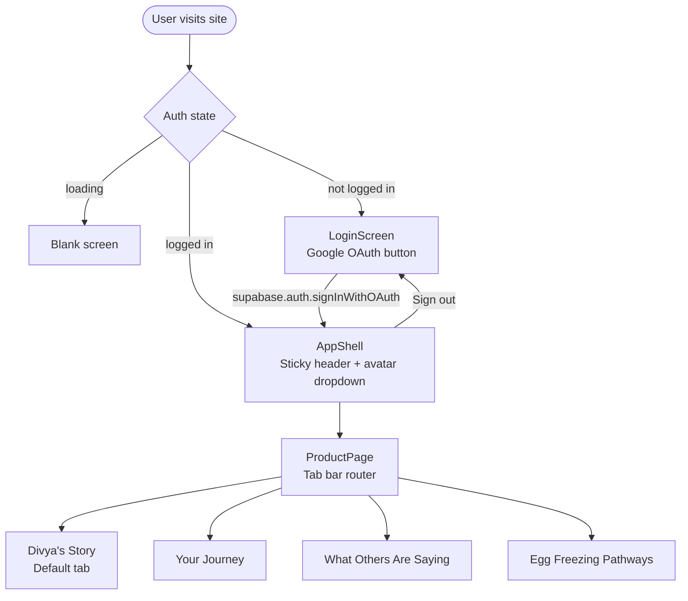
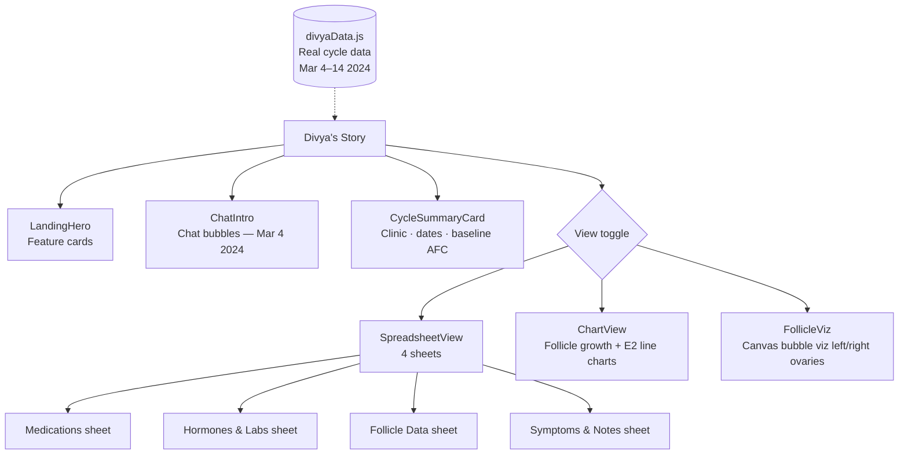
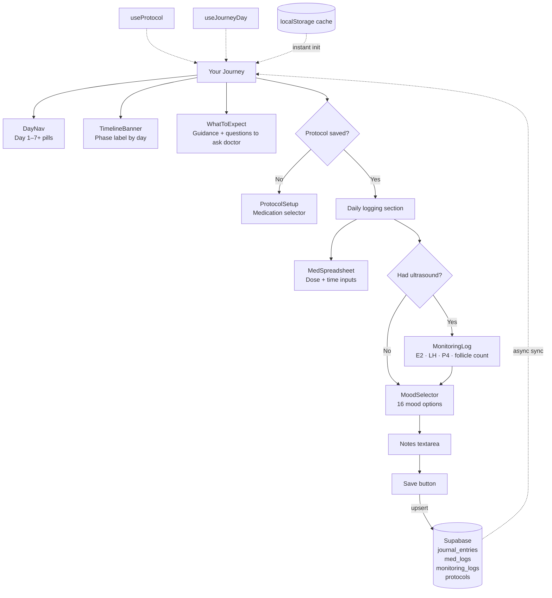
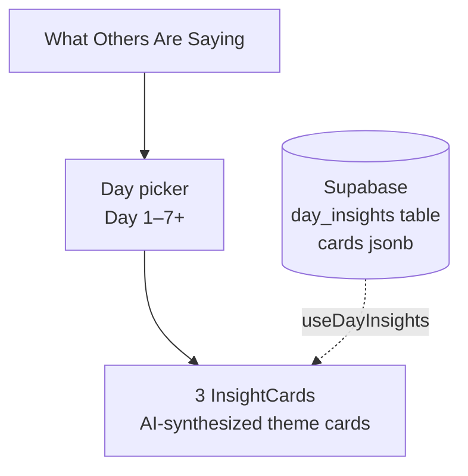
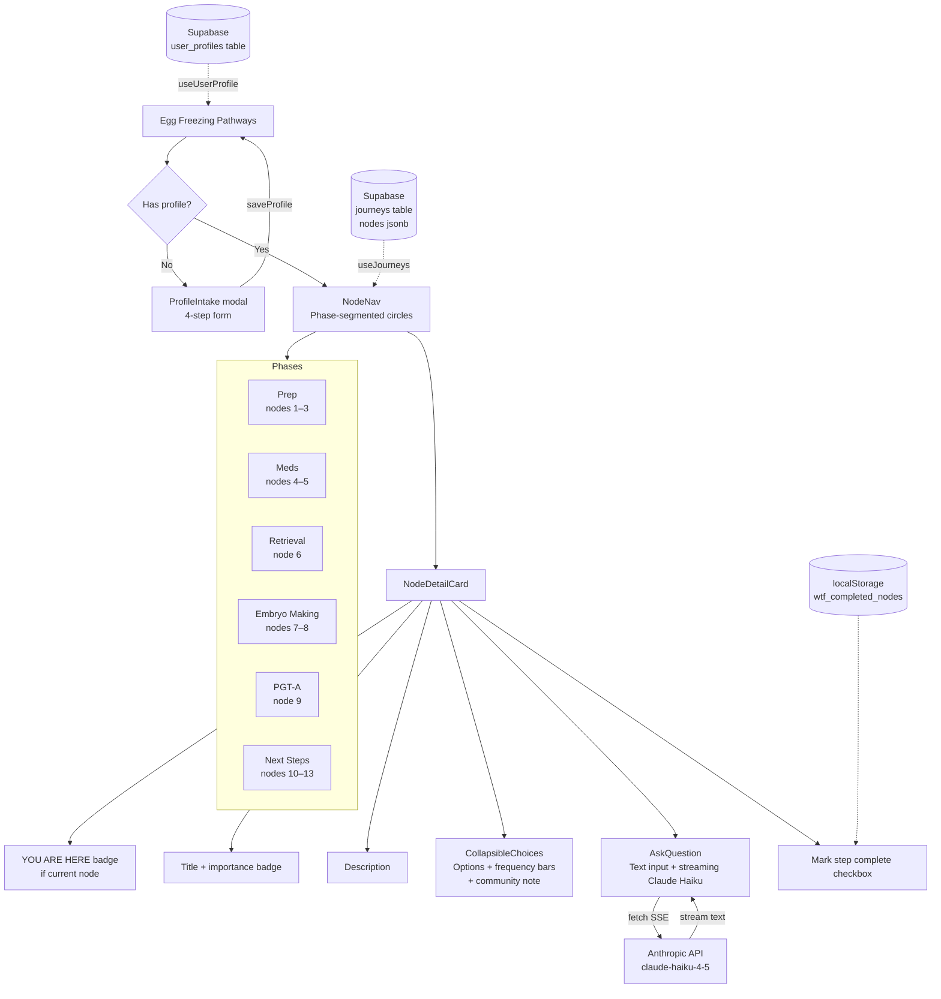
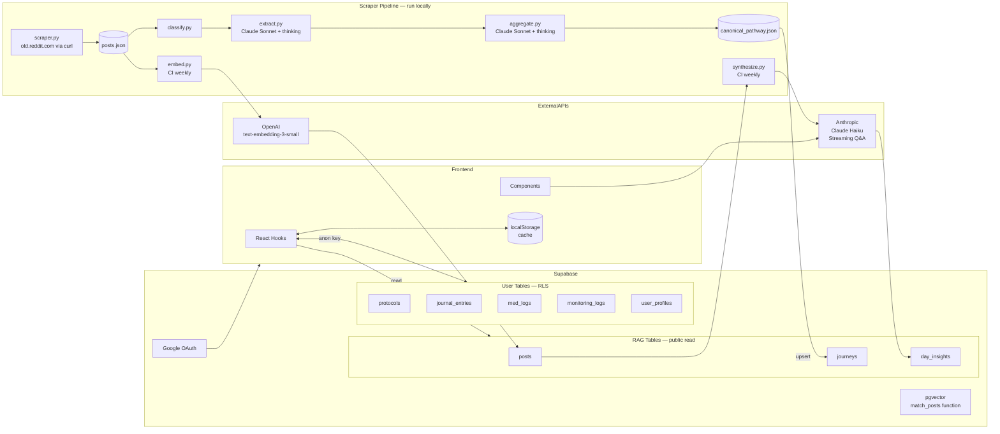
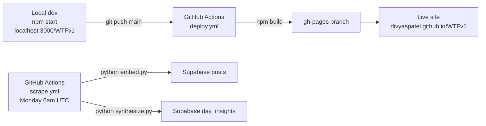

# WTF Fertility — Sitemap & Architecture

_Last updated: 2026-03-27_

---

## User Flow

---

## Tab: Divya's Story

---

## Tab: Your Journey

---

## Tab: What Others Are Saying

---

## Tab: Egg Freezing Pathways

---

## Data Architecture

---

## Deployment

